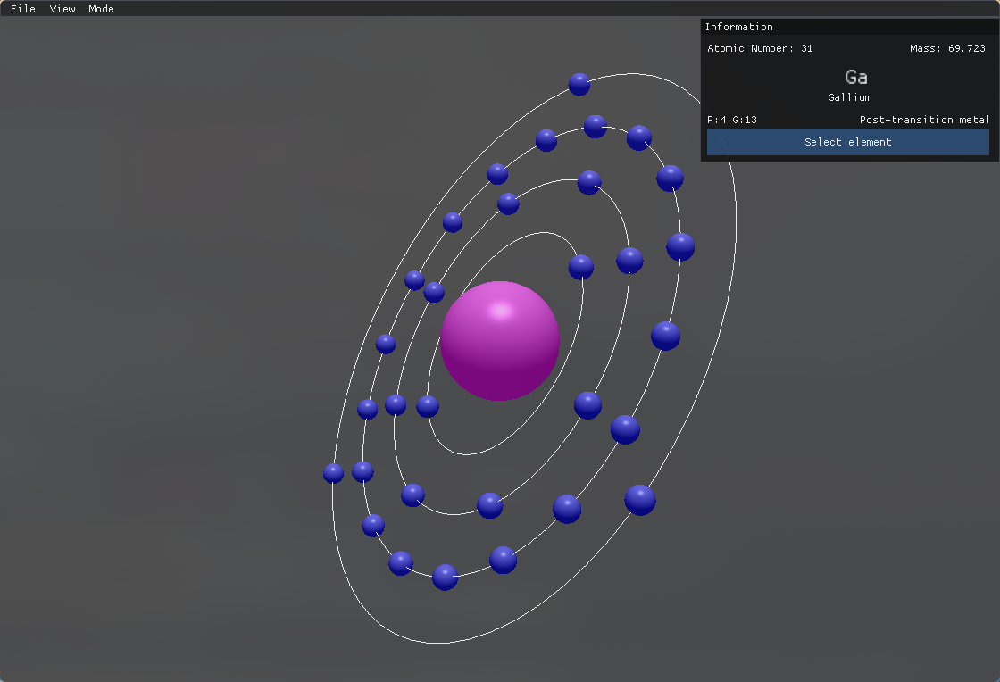
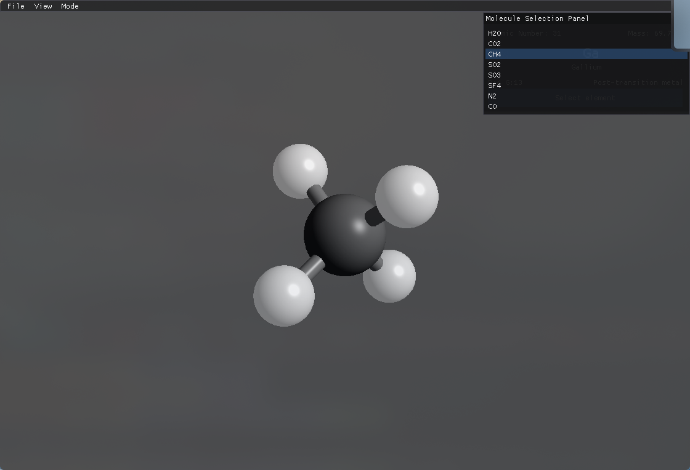
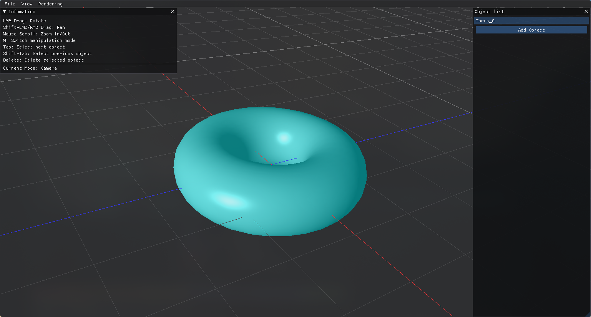

# OpenGL Projects

This repository includes some simple OpenGL applications implemented with GLFW and Python ImGUI as part of the ***Computer Graphics*** course.

## Project Structure
```
OpenGL-Projects/
├── atom-visualizer/            
└── mini-blender/                
```

Each application has the following structure:

```
application-name/
├── app/        # Defines essential components such as renderer, world grid, scene manager, etc...
├── lib/        # Implements OpenGL buffer management, shader, transformation logic
├── objects/    # Defines different drawable objects in the application
├── shaders/    # Includes some shaders such as Phong, Gouraud, Phong with texture
└── main.py     # Entry point for the application
```

## Application description

### Atom visualizer
```html


```

Visualization of atoms using Bohr's model. Has a GUI for selecting different elements from the periodic table.

Visualization of some simple molecules (H2O, CO2, ...) using ball and stick models.

### Mini blender


Simple application that can render variety of 2D and 3D objects:
- 2D Shapes: triangle, rectangle, pentagon, regular hexagon, circle, ellipse, trapezoid, star, arrow.
- 3D Shapes:
    + Basic solids: cube, sphere, cylinder, cone, truncated cone, tetrahedron, torus, prism.
    + Mathematical surface defined by a user-provided function z = f(x, y).
    + Imported 3D model from .obj or .ply file.

Support mouse interaction to zoom, pan, view the scene and keyboard interaction for manipulating the objects, changing different rendering modes.

The application provides multiple rendering modes for each object:
- Flat color (single uniform color for the entire object).
- Vertex color interpolation using Gouraud shading.
- Phong shading (with per-fragment lighting).
- Wireframe mode for visualizing only the edges of the shape.


## How to run

1. Install the required packages in `requirements.txt`
2. Active the environment, then run the `main.py` file for a desired application. For example, you can do

```sh
python mini-blender/main.py
```
